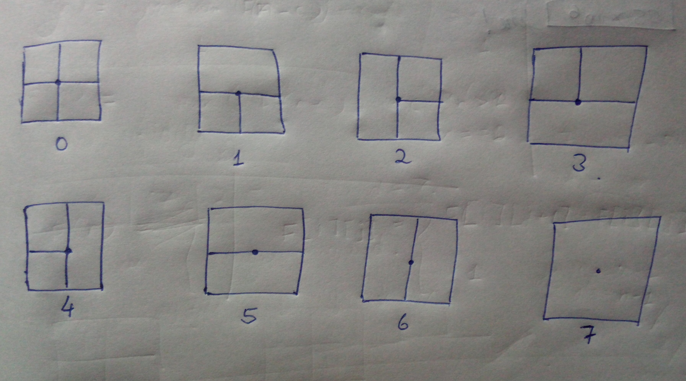
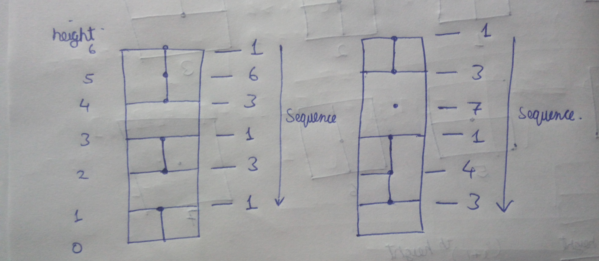
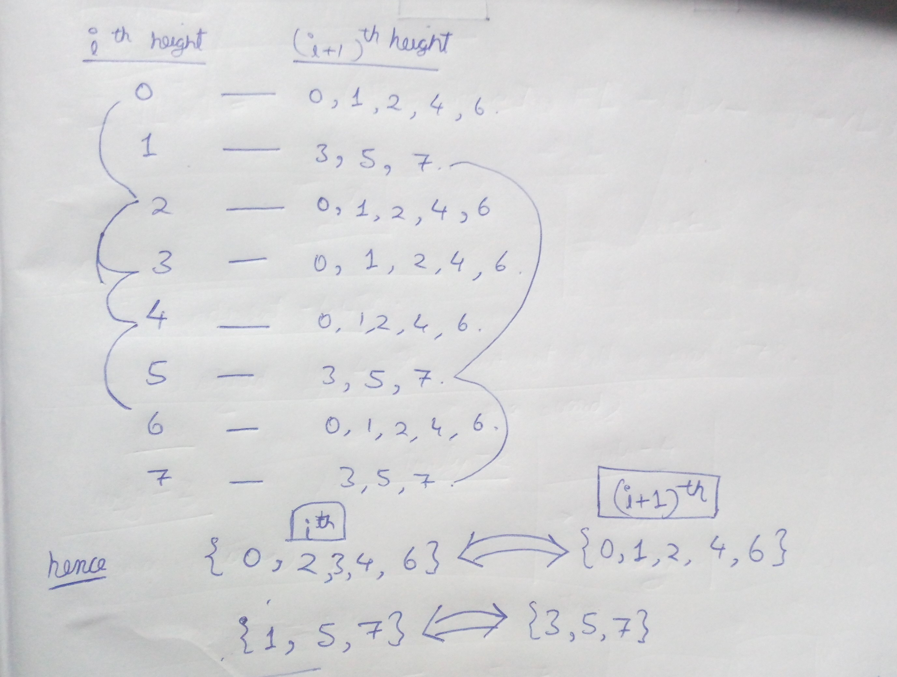

[problem](https://cses.fi/problemset/task/2413/)

This looks like variation of tiling problem in dp. What makes this problem intersting is there is no predefined dimensions for the tile. The harder part here is how do we identify a particular solution? thanks to this [video](https://www.youtube.com/watch?v=MxhA0bY31wM&t=1171s) which gave a very effetive way to do it.

Representing a valid tower

    The idea being look at the cross section point at each level which is present in the middle. There are only 8 possible ways for it as given below.

    

    Now with the help of these 8 possible cases any tower can be represented as sequence of numbers. example given below.

    

    Now that we can visulaize a tower as a sequence of numbers.
<strong>This problem just becomes a counting problem in which we have to count the number of valid number sequences</strong>.

Invalid cases

    There are some cases that can't be adjascent to one another. like case 1 can't be on the of case 5 (cause case 1 has a line on bottom but case 5 doesn't have line on top). There are many such invalid cases.

    Here I have mapped valid (i+1)th cases for ith cases.

    

    hence only these valid cases can be kept adjascent to one another. 

    NOTE: For any valid tower on the top only case 1 and case 5 possible.

RECURSION IDEA

    The idea being to move from top of the tower to bottom(constructing this way will help us in bottom up solution). At each level/height keep track of which case (out of all 8) is present at that level. Now move to one height below it and apply all only valid cases out of all 8 cases recursively. 

    suppose we are at level 5 and cross section case is 1 then at level 4 we can only apply case 3,5 and 7.

    Take sum of all possible solutions since we have to count.

    If we reach the bottom of tower then we found a valid solution hence return 1 to count it.

SUBPROBLEM

    F[i][j] represents the number of solution for tower of height i for which jth case cross section is present on ith level.

RECURRENCE RELATION

    F[i][j] = sum(F[i-1][k]) where k is valid case for j. for all value of k
    F[i][j] = 1 when i = 1 (base case)

MEMOIZATION

    since each problem can be uniqely identified by i (height of tower) and j(cross section case) so we can maintain a matrix of dimension nX8.

BOTTUM UP

    Just like memoization we can maintain a matrix dp of dimension nX8. Initialize base case that is 1st row should all contain 1. Now we will move in opposite way of recursive solution. We will build the tower from height 1 to height n. Then we can easily implement loops for recurrence relation given above.

    Finally our answer will be dp[n][1]+dp[n][5] since only case 1 and case 5 is a valid tower.

time - O(8n) space - O(8n)

Here we can't optimize space since we have to answer queries for which we should maintain whole table. 