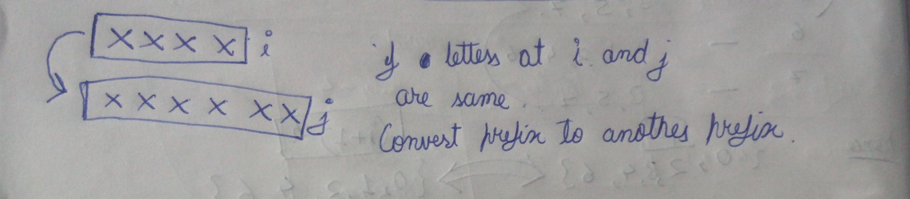
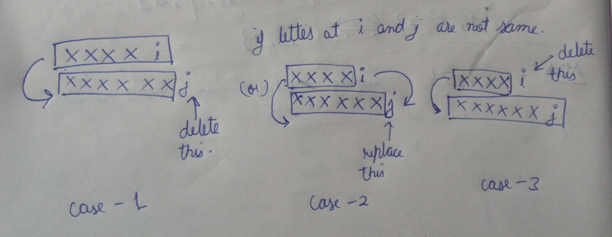

[problem](https://cses.fi/problemset/task/1639)

This is quite similar to other problems such as LCS. 

As with other string algorithms here as well we will solve these problems keeping strings prefixes in mind. 

Now think about how will you convert one prefix string to another prefix string.

    Let's take a case here

        XXXXi
        XXXXXXj

    here we want to convert first prefix string to second prefix string. i and j are position indexes.

    so first if the letter at i is same as letter at j then we simply convert prefix of first string to prefix of second string.

    

    however if letter at position i is not equal to letter at position j then we have three possible ways to convert it.

    

    We need to consider the efficient or minimum out of all these three cases. 

So the idea of recursion is at any position i in string A and any position j in string B if A[i] == B[j] then just recursively solve for prefix i-1 and j-1. If A[i] != B[j] then try three possibilities mentioned above and take minimum out of all three. 

What about base case. The base case is when either i = 0 or j = 0 (remember to use 1 based indexing) this means when we have to reduce one string to empty string. In that case result will be just length of that string. 

SUBPROBLEM

    F[i][j] represents number of moves to convert prefix i string A to prefix j string B.

RECURRENCE RELATION

    F[i][j] = F[i-1][j-1] if A[i] == B[j]
    F[i][j] = min(F[i-1][j],F[i-1][j-1],F[i][j-1]) + 1
    F[0][j] = j (base case)
    F[i][0] = i (base case)

MEMOIZATION

    A matrix of dimension (n+1)X(m+1) will be sufficient to store all sub problems.

BOTTOM UP

    We can construct bottom up solution having a dp matrix of same dimensions as memoized matrix. Initialize all base cases and just folow the recurrence relation.

time - O(mn) space - O(mn)

space can be reduced to O(m) or O(n) if you want.
