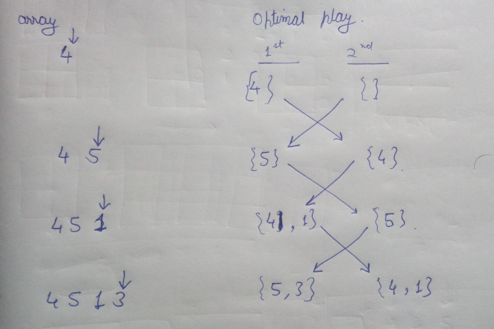

[problem](https://cses.fi/problemset/task/1097/)

This problem is a good combination of game theory and dp. First before approching the problem let's see how playing game optimally affect the solution.

Few Notes:

    For a given data THERE IS ONLY ONE WAY TO PLAY A GAME OPTIMALLY.

    Both players try to maximize their score as much possible. The first players holds advantage as he will opt always for better solution.

Let's see how and why dp is a thing here. Observe how a game is played from smaller cases to bigger cases.

    

Few very important observaions from this

    See how first player always chooses for better solution(his total is greater than other player)

    The bigger problem of playing game is just an extension to playing smaller games. Hence solution to bigger game can be derived easily with solution to smaller game problem. (reason for dp)

    The concept of REVERSING. Notice how set of numbers that belongs to first player in ith problem , it belongs to other player in (i+1)th problem.

How to represent the sub problem

    The best way to do it is to store the first player score as +ve numbers and secong player as -ve numbers
    For example:
    In last case given above

    we will store +5+3-4-1 = 3

    but why this way? This gives us certain advantage

    1. with this number we can easily get score of first player and score of secong player.
    2. If we change the sign of all number like -5-3+4+1 this gives us opposite case when 5 and 3 belong to second player and 4 and 1 to belong to first player (this helps with concept of reversing)

SUBPROBLEM

    F[i][j] represents the optimal play score of player1-player2 when we consider only numbers from i to j in array.
    
RECURRENCE RELATION

    F[i][j] = max(x[i] - F[i+1][j] , x[j] - F[i][j-1]) ,check if it is optimal to pick left or right number
    F[i][j] = x[i] when i == j since only one element is present in subprblem that will be taken by first player.

MEMOIZATION

    matrix of dimension (n)X(n) will sufficient to store all the subproblems.

BOTTUM UP 

    dp matrix of nXn is enough to solve this. Just follow the recurrence relation. Start from last row left most column and calculate bigger problems.

    Finally F[0][n-1] will contain the solution

    NOTE: we have to convert this number to score of fist player. This can be done easily by adding sum of all numbers of array to this value and divide by 2.

time - O(n^2) space - O(n^2)

space can be optimized to O(n)

