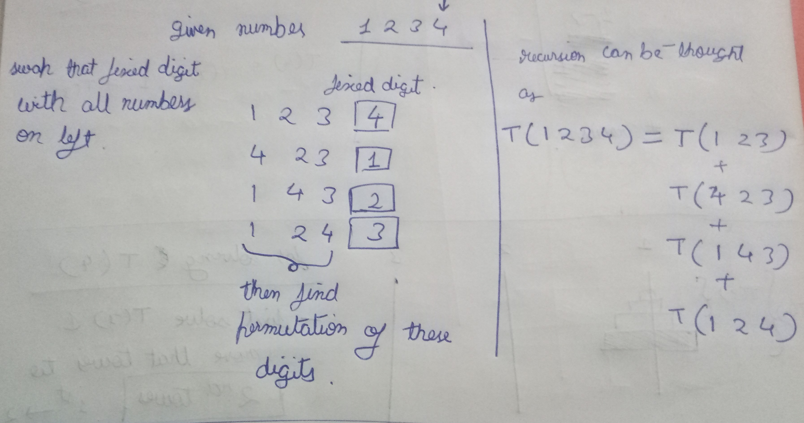

[problem](https://cses.fi/problemset/task/1622/)

This problem is basically permutation algorithm. We have to generate all possible permutation of given string and then do the post processing.

1. First let's understand logic of generating all possible permutation given an array with recursion. 

    Ex:

    suppose given number is 1 2 3 4

    the idea is to fix one number (here our last digit ) and then find all possible permutations of rest of the digits with recursion.

    to generate all permutations the fixed numbers should be swapped all other digits for new possible cases.

The below image shows how we solve the current problem based on sub problems. 

    

Below is the part of recursion tree. Recursion terminates when there is no digits available on left side.

The recursion depth of all branches will be n.

    

From all these we can say that recurrence relation is **T(n) = n*T(n-1)**

and hence time complexity is **n!**

2. Now coming to the question, once all permutation are found. we can sort them in increading order. But we have to only print unique results. We can ignore repeating value simply by comparing it with previous value. 

3. Number of premutation can be calculated in advanced with permutation math. or you can calculate unique values in your answer array. 
