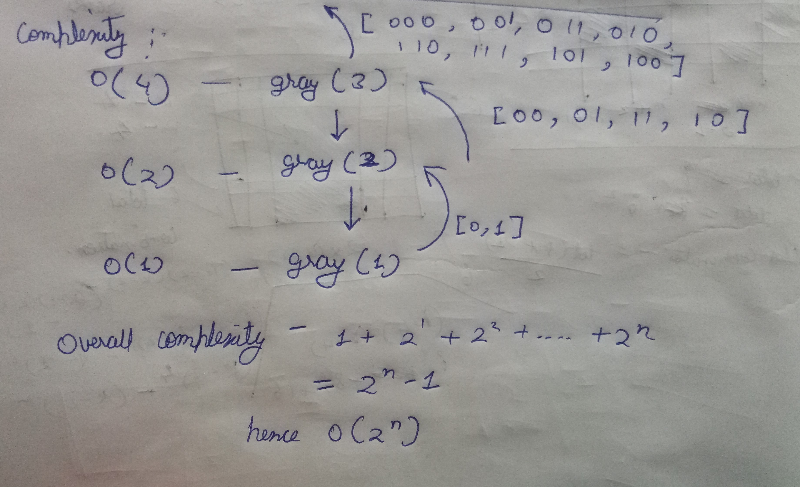

[problem](https://cses.fi/problemset/task/2205/)

We know that gray numbers are string bits that differ by only one bit.

The solution is based on the fact that nth bit gray code can be easily derived from gray code of (n-1)th bit.
```
Ex:

2bit gray code is
    00 01 11 10
to derive 3bit gray code from it:

1. Make two copies of 2bit gray code. 
    00 01 11 10
    00 01 11 10

2. Insert 0 in start of all elements of first list.
    110 111 101 100

3. Insert 1 in start of all elements of second list.
    100 101 111 110

4. Reverse the second list and concatenate with first list. we have list of 3bit gray code. 

    000 001 011 010
    110 111 101 100

```
This gives us the base of our recursion resolution.

Let's see recursion working

<p align="center">
    
</p>

here I have taken all string operation to be of O(1) for better understanding. 