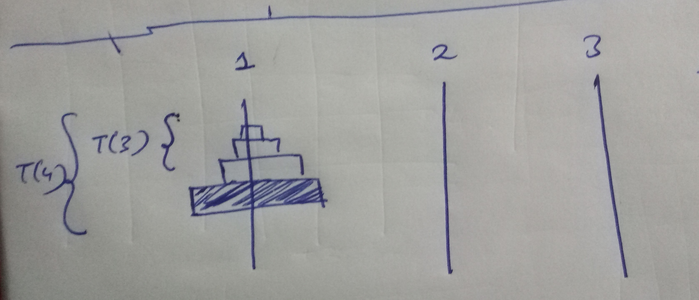
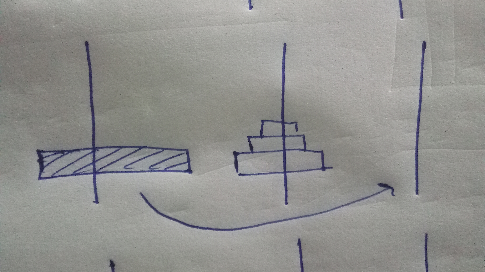
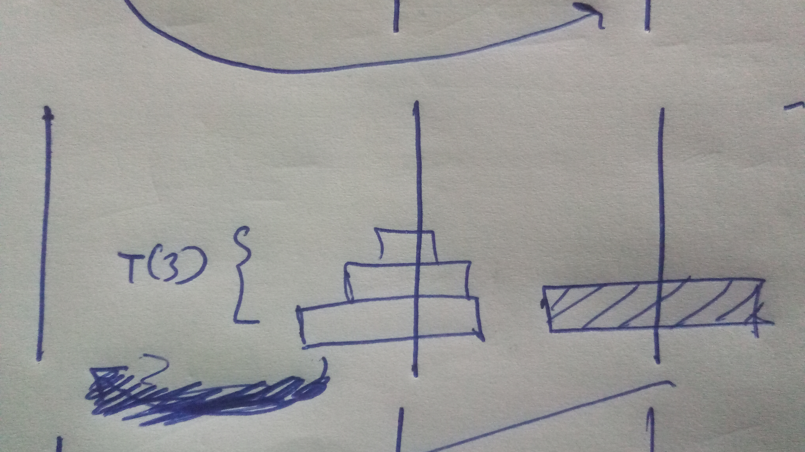

[problem](https://cses.fi/problemset/task/2165/)

Very famous recursion problem. 

The solution can be understood on how we derive the recurrence relation. 

    let's suppose our function name is
    
        T(n,source,destination,aux)

    n is the number of disks to be moved.
    source is the tower from which we should move our disk.
    destination is the tower to which the disk is supposed to go.
    aux is the tower which should be used for intermediate steps in moving.

let's take example of how to solve tower with 4 disks ie **T(4,1,3,2)**
we have to move 4 disks from tower 1 to tower 3 by using 2 as intermediate/auxilary tower.

    

so it's easy to observe that solving T(4) is just like solving T(3) and moving one disk.

1) so what we can do is move first three disks (ie n-1 disks) to the second tower that will be **T(3,1,2,3)**. 
Here we will use 3rd tower as helping tower to do it.

    

2) Now once n-1 disks are moved we can move the largest disk to thrid tower. This will be O(1) single operation. 

    

3) Finally we can observe that problem T(4) has been reduced to solving T(3) sub problem. This time our goal is to move 3 disks (ie n-1 disks) from tower 2 to tower 3 taking 1st tower for helping.
so that will be **T(3,2,3,1)**

after doing all these all disk will be on 3rd tower.

hence the overall we can relate them as 

    T(4,1,3,2) = T(3,1,2,3) + 1 + T(3,2,3,1)
    
    or simply T(4) = T(3) + 1 + T(3)

    hence recurrence relation can be written as 

    T(n) = T(n-1) + 1 + T(n-1)

using the above recurrence relation we can derive the overall time complexity to be **2^n-1**.