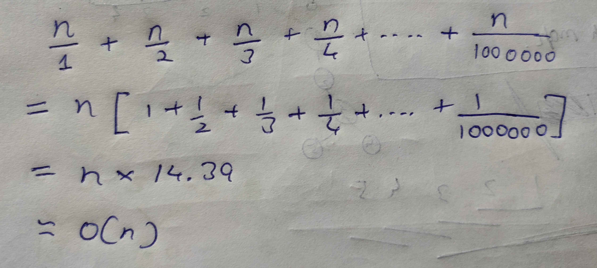

[problem](https://cses.fi/problemset/task/1713/)

Note few things about this we only want the count and limit is million. This points us to one conclusion we can maintain one array which has all results pre-computed. 

This is quite similar to Sieve of Eratosthenes technique but here we count the divisors instead.

For every number i we increment count for every multiple of i. In end queries can be answered in constant time.

Below is time complexity for it.

    

