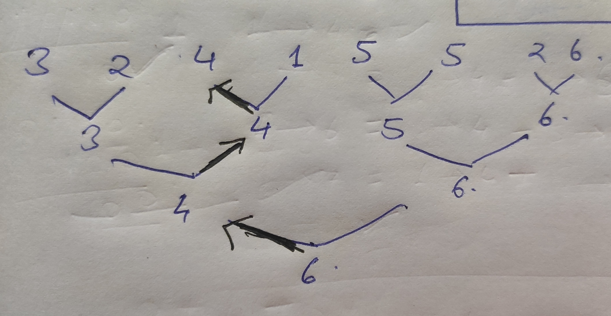

[problem](https://cses.fi/problemset/task/1143/)

In first look this questions doesn't feel like a range query question but observe the sentence here **"You always assign a group to the first hotel having enough rooms"** hence we need to find the leftmost enough sized room. 

The idea is to maintain a maximum segment tree here. since a segment tree is just a binary tree, we can search for hotel room sized enough in logn time. 

The idea of binary search is start from root node and check if maximum value if sufficient to give a room if not return -1, if yes check on left first(since we want room on left) if we have an enough sized room, if yes move to left otherwise move to right. Stop the search if you reach a leaf node and return the index of found room. 

Below is example of how we search for a room of size 4

    

We will update the value at this index. This can be done in logn time since it's a segment tree.