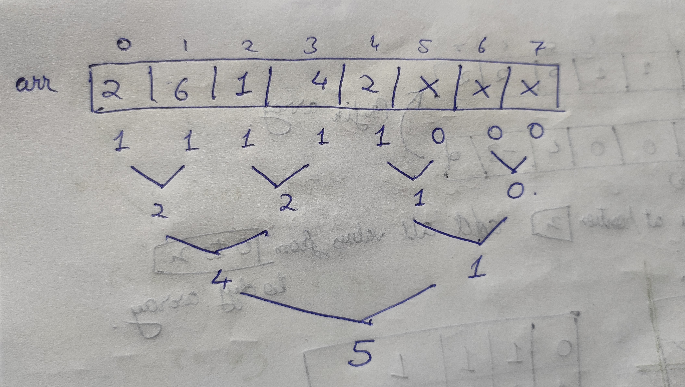

[problem](https://cses.fi/problemset/task/1749/)

Another good question that gives no hint of using range query. There are other solution using BIT but I have used a segement tree since it's easy to understand. 

The idea is to maintain a segment tree that stores the number of elements present in a range. Everytime we remove one element from array. We decrement one value from respective nodes in segment tree.

HOW TO SEARCH FOR APPROPRIATE POSITION?

    We can binary search this. Imagine if we want to search for position x.Since ST is a binary tree we can start from root node and first check on it's left side if there are more than or equal to x numbers, if yes move to left, if no move to right and look for a position **(x-number of elements on left side of tree.)**. The search stops if we reach a leaf node and we return the index. 
    Remember as we traverse down the tree we decrement one value from all nodes that we visit since we are deleting one number from array. 

For the given test case our segment tree will look like this-

    

Now if we want to search for position 3 we will traverse the tree like this-

    

