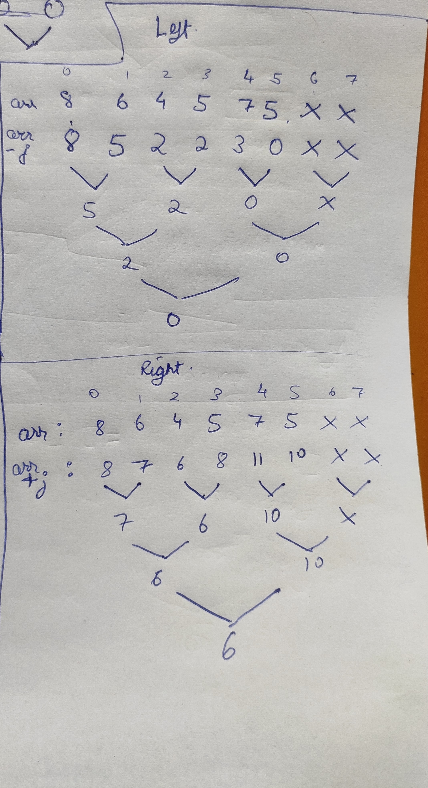

[problem](https://cses.fi/problemset/task/2206/)

We can solve this with segment trees. The approach is based on small mathemetical obervation here.

    Suppose we are at ith block and we order the pizza from jth block so our cost will be p(j) + |i-j|.

    Now here j can be greater than i(if we order from right blocks) or j can be less than i(if we order from left blocks)

    Hence in case we order from left block, it will cost = p(j) - j + i
    otherwise if we order from right block, it will cose = p(j) + j - i

    Obsever something here, the value of p(j)-j (or) p(j)+j is same for all blocks no matter from where we order. The only thing changes is i based upon where we order from.

    Hence to order at cheapest cost we should first the minimum value of p(j)-j on left side of i and minimum value of p(j)+j on right side (This can be done with minimum segment tree). once we have these minimum values. We will add i to left side result and subtract i to right side result (see formula above). Out of these two cases we will take minimum. This will be our answer

We will need to maintain two segment trees one for maintaining minimum p(j)-j in range and other one for maintaining minimum p(j)+j in range.

Here is how the segment trees will look for the test case given in problem

    

