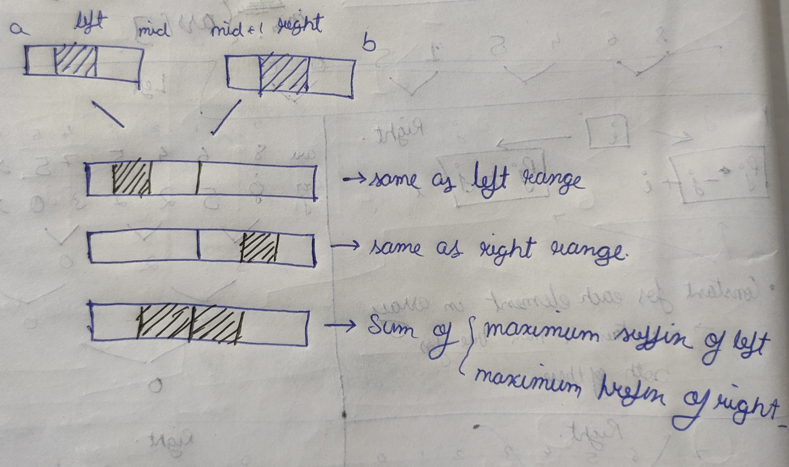

[problem](https://cses.fi/problemset/task/1190/)

This problem can be solved using segment trees. Let's build the solution steps by step.

    Let's imagine a scenario where we already know the the max sum subarray in two child ranges,how do we generate result for parent range?

    There are three possible results.
        1. The max sum subarray will be same as the subarray of left range.
        2. The max sum subarray will be same as the subarray of right range.
        3. The max sum subarray will be formed on intersection. hence it will be sum of maximum suffix of left range and maximum prefix of right range.

    (scribbled area is subarray with maximum sum)

    

 

After these observations we understand that we have to construct 4 segments trees.

    1. to store maximum sum subarray in range (this is what our question expectes)
    2. to store the maximum prefix sum of range (this we have done in previous questions)
    3. to store the maximum suffix sum of range (this is opposite case of prefix)
    4. to store the sum of range (this is used for calculating prefix and suffix)

The easy part of this question is there is no range queries. They expect us to give the result of whole array which will be stored at the root node of our first segment tree.