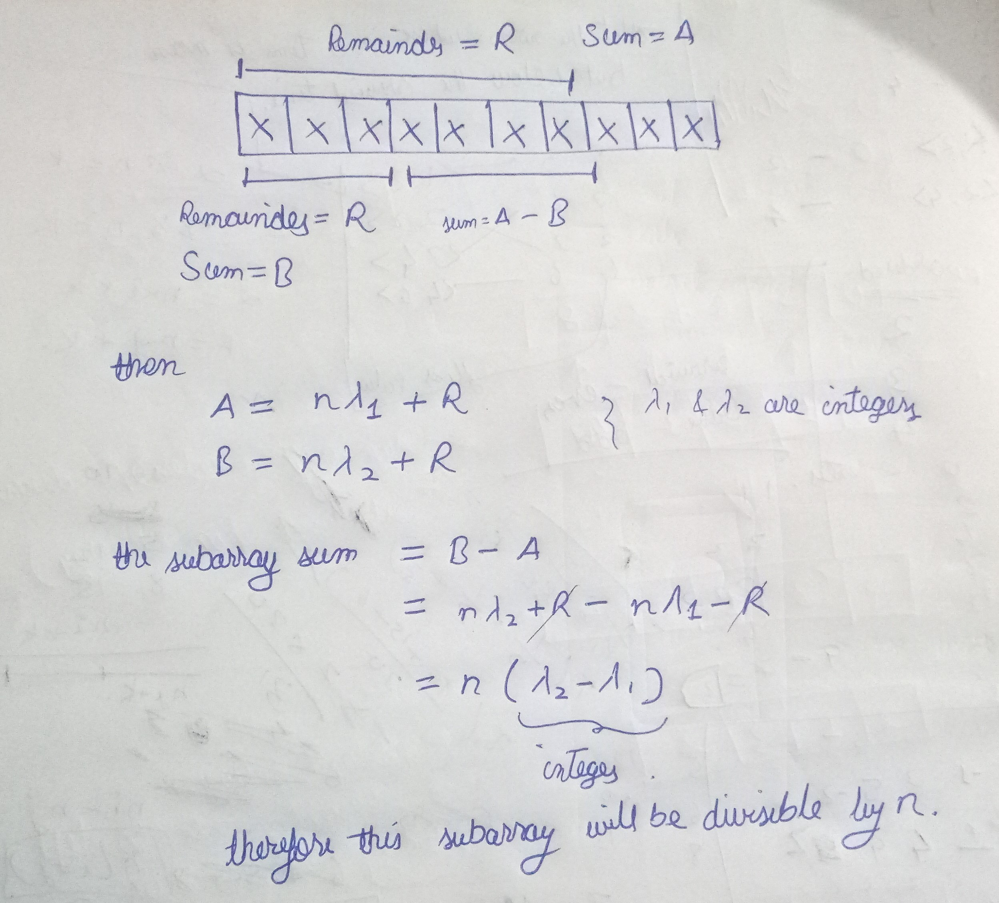

[problem](https://cses.fi/problemset/task/1662/)

This is a modification to previous problem. Here our point of interset is remainders of prefix arrays not sum of prefix arrays.

What we do from here?

    The idea here is any prefix array that gives the remainder R and there exist another prefix array before it that also gives remainder R then the subarray containded between them is divisible by n. 

But why? Below is explaination.

Now a small change to code from previous question and it will work for this question as well.

    hence every prefix array with remainder R will combine with all other prefix arrays with remainder R.

The above statement gives us a hint for a simpler solution. In alternate solution we just have to count how many times a prefix remainder number repeats. and combine all of them each each other. Now this question becomes a counting problem which is simple to implement. But without the above explaination it's hard to understand why simple solution works. 