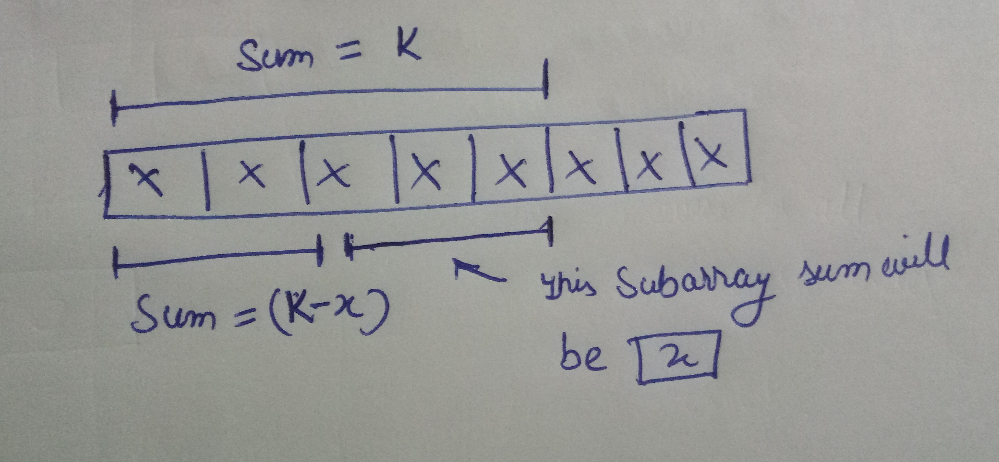

[problem](https://cses.fi/problemset/task/1661/)

This is an extension to previous problem the new thing here is we have to handle negative numbers this time.

Since negative numbers breaks the logic of sliding window techinque we can't use it here.

So what's the idea? We will make use of **prefix sum array**(arrays that store the sum of values from 0th index to ith index) to solve this question.

How is prefix arrays useful to us?

    If there exist a prefix array whose sum is K and another prefix array whose sum is (K-x) then the subarray between these prefix array will have the sum of x.

So our problem has been changed to the following

    For each prefix array with sum K count the number of prefix arrays whose sum is (K-x). Sum of all those numbers is our required answer.

We can use map(C++), HashMap(java) or dictionary(python) to easily maintain the key value pair in which prefix sums have been mapped to their count of occurances. 

NOTE: The map should not be precalculated since for each prefix array we only want smaller prefix arrays on left. 

If you pre-calculate prefix array then final result should be half of total count. 
