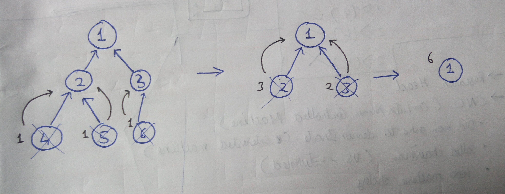

[problem](https://cses.fi/problemset/task/1674/)

In short this problem is to calculate size of all subtrees. The intersting part is the way in which tree is given to us. Here the child are pointing to parent instead of parent pointing to child nodes.

## Thought 1

Simply convert the given tree to adjacency list and do dfs with backtrack. (Since it's simple to count sub-tree size this way)

## Thought 2

But what if we wan't to solve this with given tree structure only. 

The idea is since child points to parents. we will start from leaf nodes and traverse up. As we process leaf nodes. we will remove all leaf nodes logically. This will give us new tree with new leaf nodes. We will repeat same process until no nodes are left in tree.

Remember subtree size is size of all children + 1.

    

How do we get leaf nodes? First we cound for each node how many direct children they have. This can be done in O(n). Then all nodes for which count is zero will be leaf nodes which I maintain in a queue. Then we can process each node from queue and insert new nodes in queue as we remove nodes from tree. 

time - O(n)