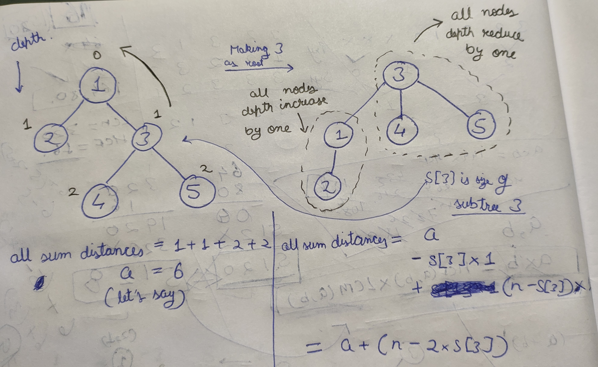

[problem](https://cses.fi/problemset/task/1133/)

The solution idea is to calculate the all distance sum at one arbitary node(1 in my case) and then using result of that calculate the result for all other nodes by rerooting tree to other nodes.

Let's try to visualize what happens when we reroot a tree to it's child

    

So the result for any child node can be easily calculated if we already know the result of parent node and the size of subtree of child node.

We can preprocess the subtree size for all nodes in O(n) and calculate all distance sum for root node in O(n).

Once we have that we can do one more dfs to calculate the result for all nodes. Finally print the result.

time - O(4n)